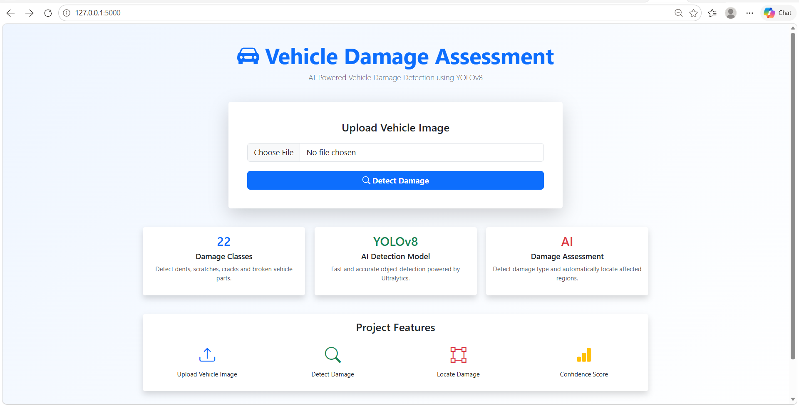
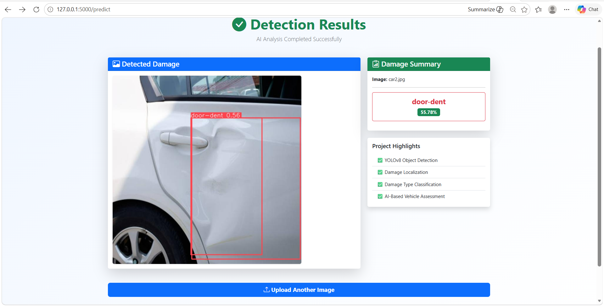

# Vehicle Damage Assessment System

An AI-powered vehicle damage assessment system built using YOLOv8, Flask, Python, and Bootstrap 5.

The system allows users to upload vehicle images and automatically:

* Detect vehicle damage
* Classify damage type (dent, scratch, crack, etc.)
* Localize damaged regions using bounding boxes
* Display confidence scores for predictions

## Features

* YOLOv8 object detection model
* Real-time damage analysis through a web interface
* Damage localization with bounding boxes
* Confidence score visualization
* Responsive Bootstrap 5 UI
* Flask backend integration

## Tech Stack

* Python
* YOLOv8
* Flask
* OpenCV
* Bootstrap 5
* HTML/CSS

## Screenshots

### Home Page

### Detection Results

## Author

Tanisha
24117143
Mechanical Engg